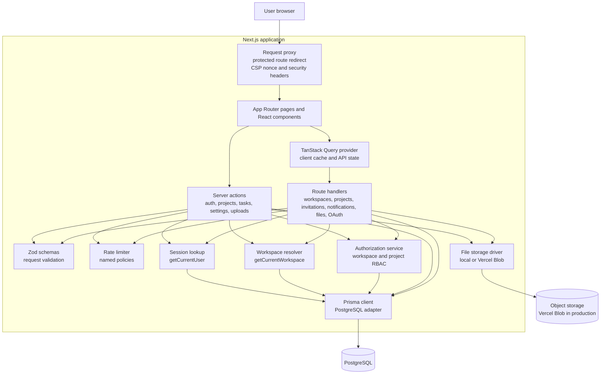
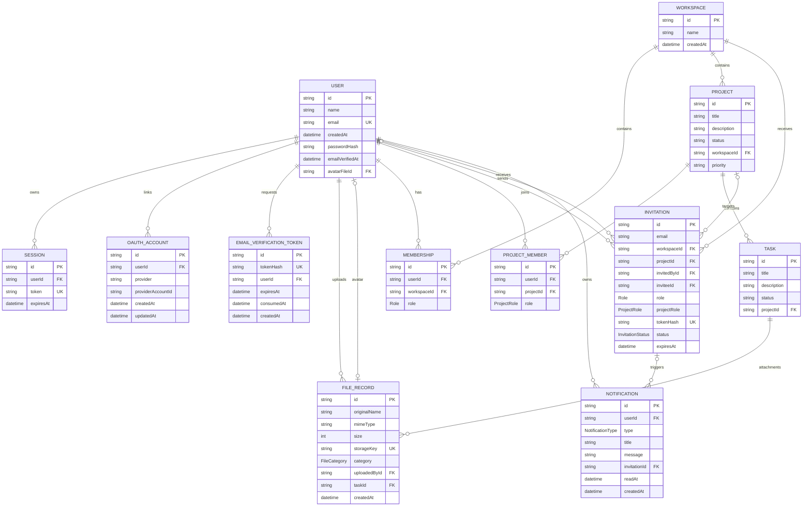
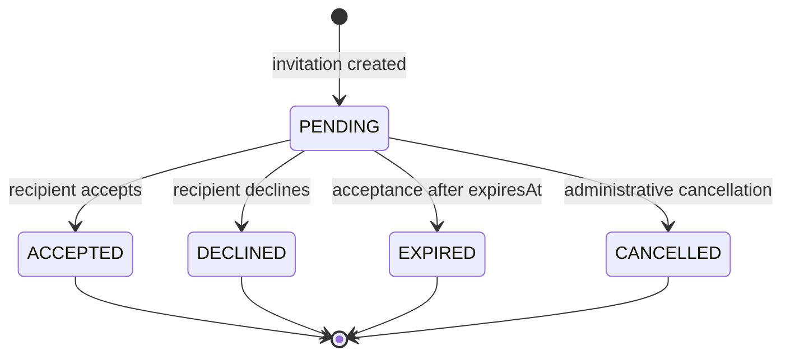
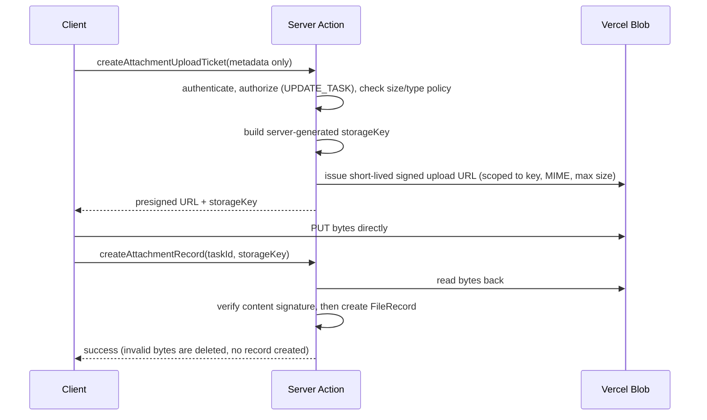

# Nexus

Nexus is a workspace-based project management SaaS application built with **Next.js**, **TypeScript**, **Prisma**, and **PostgreSQL**. The current implementation provides authenticated workspaces, project and task management, project-level membership, workspace and project invitations, and invitation notifications. The application is structured around the Next.js App Router, server actions for form-driven mutations, route handlers for REST-style access, and a Prisma data layer. [1] [2] [3]

Subsequent development added Google OAuth and email verification, persisted avatar and attachment uploads behind a storage abstraction, project search/filter/sort/pagination, workspace and account settings, a security hardening pass (CSP, security headers, origin checking, rate limiting, content-signature file validation), technical SEO metadata, and a production deployment configuration backed by Vercel Blob. [22] [24] [26] [27] [30]

> **Documentation scope:** This README describes the architecture and data model currently implemented in the repository. It intentionally distinguishes persisted Prisma models from client-side or legacy TypeScript shapes.

## Contents

- [Product scope](#product-scope)
- [System design](#system-design)
- [Backend architecture](#backend-architecture)
- [Authentication and authorization](#authentication-and-authorization)
- [Domain model](#domain-model)
- [Database schema](#database-schema)
- [Relationships](#relationships)
- [API surface](#api-surface)
- [Data integrity and transactions](#data-integrity-and-transactions)
- [Security](#security)
- [File storage and uploads](#file-storage-and-uploads)
- [Caching and revalidation](#caching-and-revalidation)
- [Performance](#performance)
- [SEO and metadata](#seo-and-metadata)
- [UI and product features](#ui-and-product-features)
- [Project structure](#project-structure)
- [Local development](#local-development)
- [Production and deployment](#production-and-deployment)
- [Validation and quality checks](#validation-and-quality-checks)
- [Current implementation notes](#current-implementation-notes)
- [Recent updates](#recent-updates)
- [References](#references)

## Product scope

Nexus organizes work inside a hierarchy of **users**, **workspaces**, **projects**, and **tasks**. A user may belong to multiple workspaces, each workspace may contain multiple projects, and project access is controlled through an independent project-membership relation. Collaboration is completed through invitations and user-scoped notifications. [7] [8]

| Capability | Current behavior | Primary implementation |
|---|---|---|
| Authentication | Registration, login, logout, bcrypt password hashing, seven-day database sessions, and an HTTP-only `session_token` cookie. Additionally supports Google OAuth (OIDC with PKCE) and email verification through hashed, expiring tokens. | [`src/actions/auth.actions.ts`][9], [`src/lib/oauth/google.ts`][22], [`src/lib/email-verification.ts`][23] |
| Workspace context | Users can switch between workspaces through an HTTP-only `current_workspace_id` cookie. Invalid selections fall back to the first workspace membership. | [`src/components/WorkspaceSwitcher.tsx`][10], [`src/lib/current-workspace.ts`][8] |
| Projects | Projects are scoped to workspaces and can be created, read, updated, and deleted with permission checks. | [`src/actions/project.actions.ts`][11], [`src/app/api/projects`][15] |
| Tasks | Tasks belong to projects and support creation, editing, deletion, and status changes. | [`src/actions/task.actions.ts`][12] |
| Collaboration | Workspace and project invitations are stored, validated, accepted or declined, and converted into membership records. | [`src/app/api/invitations`][13], [`src/app/api/invitations/%5Bid%5D/route.ts`][14] |
| Notifications | Existing users receive invitation notifications and can mark notifications as read. | [`src/app/api/notifications`][16] |
| Project discovery | Projects support title search, status filtering, five sort orders, and server-side pagination, all driven by URL search params. | [`src/lib/data/projects.ts`][24], [`src/app/(protected)/projects/_components`][25] |
| Files and avatars | User avatars and task attachments are validated, stored through a storage abstraction, persisted as `FileRecord` rows, and served through an authorized route handler. | [`src/lib/files`][26], [`src/app/api/files/%5B...key%5D/route.ts`][28] |
| Settings | Workspace rename, leaving a workspace with owner safety checks, and password change with other-session invalidation. | [`src/actions/settings.actions.ts`][29] |
| Protected application shell | Dashboard, project, settings, and invitation routes are guarded at request level when the session cookie is absent or malformed. The same layer attaches a per-request CSP nonce and security headers to every response. | [`src/proxy.ts`][4], [`src/lib/security-headers.ts`][27] |

## System design

The system follows a **modular monolithic** architecture. The browser, Next.js application server, authorization layer, Prisma client, and PostgreSQL database are deployed as one application boundary, while the code is separated into presentation, request, domain, validation, and persistence responsibilities. This keeps transactions and authorization close to the data they protect without introducing a separate backend service. [1] [2] [5] [6] [7]



### Request lifecycle

A protected page request first passes through [`src/proxy.ts`][4]. The proxy generates a per-request CSP nonce, applies the security headers described in [Security](#security) to every response, and redirects requests to `/dashboard`, `/projects`, `/settings`, and `/invitations` to `/login` when the `session_token` cookie is missing or does not match the expected token shape. The server action or route handler then performs the authoritative session lookup, verifies the session expiry, resolves workspace context when needed, and applies the relevant workspace or project permission check before mutating data. [4] [5] [6] [8]

| Stage | Responsibility | Implementation |
|---|---|---|
| 1. Browser request | Navigates to a protected page or invokes a form action/API request. | App Router UI and client components |
| 2. Route protection and headers | Performs a fast cookie-presence/shape check, redirects unauthenticated browser requests, and attaches the CSP nonce and security headers. | [`src/proxy.ts`][4], [`src/lib/security-headers.ts`][27] |
| 3. Authentication | Reads `session_token`, loads the `Session` and related `User`, and rejects missing or expired sessions. | [`src/lib/auth.ts`][5] |
| 3b. Request-level protection | State-changing route handlers verify the request origin; sensitive entry points consume a named rate-limit policy. | [`src/lib/csrf.ts`][31], [`src/lib/rate-limit`][32] |
| 4. Context resolution | Reads `current_workspace_id`, confirms membership, and returns the active workspace. | [`src/lib/current-workspace.ts`][8] |
| 5. Authorization | Evaluates workspace or project role permissions. | [`src/lib/authorization.ts`][6] |
| 6. Validation and persistence | Validates input with Zod and executes Prisma queries or transactions. | [`src/schemas`][17], [`prisma/schema.prisma`][7] |
| 7. Response and refresh | Returns an action state or JSON response and revalidates affected Next.js paths where applicable. | [`src/actions`][11] [12] |

## Backend architecture

The backend is implemented inside the Next.js application rather than as a separate service. Server actions are used for form-oriented workflows such as registration and project/task mutations. Route handlers provide explicit HTTP endpoints for workspace selection, project access, membership reads, invitations, and notifications. Both entry points share the same Prisma client, Zod schemas, session lookup, and authorization service. [6] [11] [12] [15]

| Layer | Responsibility | Repository location |
|---|---|---|
| Presentation | Server-rendered pages, client components, navigation, workspace switching, and notification controls. | `src/app`, `src/components` |
| Client data state | Provides a shared TanStack Query client for browser-side API state and cache management. | [`src/providers/query-provider.tsx`][3] |
| Server actions | Executes authenticated mutations and revalidates affected paths. | `src/actions` |
| HTTP API | Exposes JSON route handlers for workspaces, projects, members, invitations, and notifications. | `src/app/api` |
| Validation | Enforces request shapes and user-facing domain values before persistence. | `src/schemas` |
| Security | Resolves sessions, applies workspace/project role-based permissions, enforces request origin, rate limits sensitive endpoints, and builds the CSP/security headers. | [`src/lib/auth.ts`][5], [`src/lib/authorization.ts`][6], [`src/lib/csrf.ts`][31], [`src/lib/rate-limit`][32], [`src/lib/security-headers.ts`][27] |
| File storage | Validates uploads and persists bytes through a driver interface (local filesystem or Vercel Blob), keeping bytes out of PostgreSQL. | [`src/lib/files`][26] |
| Identity and email | Google OIDC/PKCE flow and Nodemailer-based delivery for verification and invitation email. | [`src/lib/oauth/google.ts`][22], [`src/lib/email`][33] |
| Persistence | Creates the Prisma client with the PostgreSQL adapter and manages generated types. | [`src/lib/prisma.ts`][18], [`prisma.config.ts`][19] |
| Database | Stores relational application state in PostgreSQL. | [`prisma/schema.prisma`][7] |

## Authentication and authorization

Nexus uses database-backed sessions rather than a third-party identity provider. During registration, the password is validated and hashed with bcrypt, then the new `User`, personal `Workspace`, and owner `Membership` are created in one transaction. A seven-day `Session` is then created and its token is written to the HTTP-only `session_token` cookie. Login follows the same session-creation path after comparing the submitted password with `passwordHash`; logout deletes the session row and clears the cookie. [9]

Two additional identity paths were added after the original implementation. **Google OAuth** is implemented as an OpenID Connect authorization-code flow with PKCE: `state`, the PKCE verifier, and `nonce` are stored in short-lived, path-scoped HTTP-only cookies and verified on callback, after which the same `createUserSession` path issues the session. The resulting link is stored as an `OAuthAccount` row, and access/refresh token columns are deliberately left null because identity is re-established on each login. **Email verification** issues a random token, persists only its SHA-256 hash in `EmailVerificationToken` with a 24-hour expiry, and allows a single active token per user. [22] [23]

The authorization layer is intentionally split into **workspace permissions** and **project permissions**. A workspace membership does not automatically grant project access: project-scoped operations require a matching `ProjectMember` row. Creating a project through the server action creates the project and the creator’s `ProjectMember` owner row in the same transaction. [6] [11]

### Workspace roles

| Workspace role | Create project | Update project | Delete project | Create task | Update task | Delete task | Invite member | Update workspace |
|---|---:|---:|---:|---:|---:|---:|---:|---:|
| `OWNER` | Yes | Yes | Yes | Yes | Yes | Yes | Yes | Yes |
| `ADMIN` | Yes | Yes | Yes | Yes | Yes | Yes | Yes | Yes |
| `MEMBER` | No | No | No | Yes | Yes | No | No | No |

### Project roles

| Project role | View project | Update project | Delete project | Create task | Update task | Delete task | Manage members |
|---|---:|---:|---:|---:|---:|---:|---:|
| `OWNER` | Yes | Yes | Yes | Yes | Yes | Yes | Yes |
| `MEMBER` | Yes | No | No | Yes | Yes | No | No |

> **Security boundary:** The request proxy is an early redirect mechanism, not the complete authorization boundary. Route handlers and server actions must continue to call session and permission checks because a cookie may be present while the corresponding session is expired or invalid. [4] [5] [6]

## Domain model

The persisted domain is centered on a many-to-many collaboration model. `Membership` connects users to workspaces, while `ProjectMember` connects users to projects and stores the project-specific role. `Invitation` acts as the bridge from an invitation request to a future membership, and `Notification` provides an in-app delivery record for existing invitees. [7] [13] [14]



## Database schema

The following table summarizes the Prisma schema as it exists today. All primary keys are generated CUID strings unless otherwise noted. Optional fields are marked with `?`, and unique or compound constraints are listed explicitly. [7]

| Model | Important fields | Relations and constraints |
|---|---|---|
| `User` | `id`, `name`, unique `email`, `createdAt`, optional `passwordHash`, optional `emailVerifiedAt`, optional unique `avatarFileId` | Has many `Session`, `Membership`, `ProjectMember`, `OAuthAccount`, `EmailVerificationToken`, uploaded `FileRecord`, sent/received `Invitation`, and `Notification` records; optionally references one avatar `FileRecord` (`onDelete: SetNull`). `passwordHash` is optional so OAuth-only accounts can exist. |
| `Session` | `id`, `userId`, unique `token`, `expiresAt` | Belongs to one `User`; session validity is checked against `expiresAt`. |
| `OAuthAccount` | `id`, `userId`, `provider`, `providerAccountId`, nullable token columns, timestamps | Belongs to one `User`; unique on `(provider, providerAccountId)` and indexed by `userId`. Token columns are intentionally never populated. |
| `EmailVerificationToken` | `id`, unique `tokenHash`, `userId`, `expiresAt`, optional `consumedAt`, `createdAt` | Belongs to one `User` (`onDelete: Cascade`); indexed by `userId`. Only the hash of the token is persisted. |
| `FileRecord` | `id`, `originalName`, `mimeType`, `size`, unique `storageKey`, `FileCategory category`, `uploadedById`, optional `taskId`, `createdAt` | Belongs to one uploading `User`, optionally one `Task` (`onDelete: SetNull`), and optionally serves as one user's avatar; indexed by `uploadedById`, `taskId`, and `category`. Stores metadata only — never file bytes. |
| `Workspace` | `id`, `name`, `createdAt` | Has many `Membership`, `Project`, and `Invitation` records. |
| `Membership` | `id`, `userId`, `workspaceId`, `Role role` | Joins `User` and `Workspace`; unique on `(userId, workspaceId)`. |
| `Project` | `id`, `title`, optional `description`, `status`, `workspaceId`, `priority`, `createdAt`, `updatedAt`, optional `startDate`, optional `dueDate` | Belongs to one `Workspace`; has many `Task`, `ProjectMember`, and `Invitation` records; indexed by `workspaceId`. |
| `ProjectMember` | `id`, `userId`, `projectId`, `ProjectRole role` | Joins `User` and `Project`; unique on `(userId, projectId)` and indexed by both foreign keys. |
| `Task` | `id`, `title`, optional `description`, `status`, `projectId`, `createdAt`, `updatedAt`, optional `startDate`, optional `dueDate` | Belongs to one `Project` (`onDelete: Cascade`); has many `FileRecord` attachments; indexed by `projectId`. |
| `Invitation` | `id`, `email`, `workspaceId`, optional `projectId`, `invitedById`, optional `inviteeId`, optional `role`, optional `projectRole`, unique `tokenHash`, `status`, `expiresAt`, timestamps | Belongs to one `Workspace`, optionally one `Project`, one inviter, and optionally one registered invitee; indexed by workspace, project, email, invitee, and status. |
| `Notification` | `id`, `userId`, `type`, `title`, `message`, optional `invitationId`, optional `readAt`, `createdAt` | Belongs to one `User` and optionally one `Invitation`; indexed by user, `(userId, readAt)`, and invitation. |

### Enums and validated status values

| Type | Values | Usage |
|---|---|---|
| `Role` | `OWNER`, `ADMIN`, `MEMBER` | Workspace membership and workspace invitation roles. |
| `ProjectRole` | `OWNER`, `MEMBER` | Project membership and project invitation roles. |
| `InvitationStatus` | `PENDING`, `ACCEPTED`, `DECLINED`, `EXPIRED`, `CANCELLED` | Invitation lifecycle. |
| `NotificationType` | `INVITATION` | Current notification category. |
| `FileCategory` | `AVATAR`, `ATTACHMENT` | Distinguishes profile images from task attachments; drives the upload policy and the access rules in the file-serving route. |
| Project status | `Active`, `Completed` | Validated by the project Zod schema; persisted as `String`. |
| Task status | `TODO`, `active`, `completed` | Validated by task actions/schema; persisted as `String`. |

## Relationships

The relationship model can be read as a sequence of access decisions. A `User` first obtains workspace access through `Membership`; a `Project` belongs to a `Workspace`; and project access is granted separately through `ProjectMember`. This separation allows workspace-level roles to govern workspace administration while project-level roles govern project visibility, task operations, and member management. [6] [7]

| Relationship | Cardinality | Meaning in the application |
|---|---|---|
| `User` → `Session` | One-to-many | A user can have multiple active login sessions. |
| `User` ↔ `Workspace` through `Membership` | Many-to-many | A user may belong to many workspaces, and a workspace may have many users. |
| `Workspace` → `Project` | One-to-many | Every project is owned by exactly one workspace. |
| `User` ↔ `Project` through `ProjectMember` | Many-to-many | Project access and project role are managed independently from workspace membership. |
| `Project` → `Task` | One-to-many | Every task belongs to one project. |
| `Workspace` → `Invitation` | One-to-many | Every invitation is anchored to a workspace, including project invitations. |
| `Project` → `Invitation` | Optional one-to-many | A null `projectId` represents a workspace invitation; a populated `projectId` represents a project invitation. |
| `User` → `Invitation` | Two named one-to-many relations | `invitedById` records the sender; optional `inviteeId` identifies a registered recipient. |
| `User` → `Notification` | One-to-many | Notifications are owned by the recipient user. |
| `Invitation` → `Notification` | Optional one-to-many | An invitation notification may reference the invitation that caused it. |

### Invitation lifecycle

Invitation creation hashes a generated token before persistence, prevents duplicate pending invitations, and optionally creates a notification when the email belongs to an existing user. Acceptance is restricted to the addressed `inviteeId`, rejects non-pending or expired invitations, and then executes the membership creation plus invitation status update inside a transaction. Project invitations create `ProjectMember`; workspace invitations create `Membership`. [13] [14] [20]



## API surface

The route handlers expose JSON endpoints for the browser and other same-application clients. Most protected handlers return a consistent error payload through the shared `apiError` helper, while successful responses wrap resources in named properties such as `workspaces`, `projects`, `members`, `invitation`, or `notifications`. [15] [21]

| Method | Endpoint | Authentication and authorization | Purpose |
|---|---|---|---|
| `GET` | `/api/workspaces` | Authenticated user | Lists the user’s workspaces and returns the currently resolved workspace id. |
| `PATCH` | `/api/workspaces/current` | Authenticated user plus matching `Membership` | Sets the `current_workspace_id` HTTP-only cookie. |
| `GET` | `/api/workspaces/current/members` | Authenticated user with resolved workspace | Lists members of the current workspace. |
| `GET` | `/api/projects?workspaceId={id}` | Authenticated workspace member | Lists projects in the workspace that the user can access through `ProjectMember`. |
| `POST` | `/api/projects?workspaceId={id}` | Workspace `CREATE_PROJECT` permission | Creates a project in the requested workspace. |
| `GET` | `/api/projects/{projectId}` | Project `VIEW_PROJECT` permission | Returns one project and its selected member data. |
| `PATCH` | `/api/projects/{projectId}` | Project `UPDATE_PROJECT` permission | Updates project title, description, and status. |
| `DELETE` | `/api/projects/{projectId}` | Project `DELETE_PROJECT` permission | Deletes a project. |
| `GET` | `/api/projects/{projectId}/members` | Authenticated project member | Lists project members and their roles. |
| `POST` | `/api/invitations` | Workspace `INVITE_MEMBER` permission | Creates a workspace invitation and an optional notification. |
| `POST` | `/api/projects/{projectId}/invitations` | Project `MANAGE_PROJECT_MEMBERS` permission | Creates a project invitation and an optional notification. |
| `PATCH` | `/api/invitations/{id}` | Authenticated addressed invitee | Accepts or declines an invitation with `{ "action": "ACCEPT" }` or `{ "action": "DECLINE" }`. |
| `GET` | `/api/notifications` | Authenticated user | Lists notifications and returns the unread count. |
| `PATCH` | `/api/notifications/{id}/read` | Authenticated notification owner | Marks one notification as read. |
| `GET` | `/api/auth/google` | Public | Starts the Google OIDC flow and redirects to Google with `state`, PKCE challenge, and `nonce`. |
| `GET` | `/api/auth/google/callback` | Public callback, validated against stored cookies | Verifies `state`/`nonce`, exchanges the code, links or creates the user, and issues a session. |
| `GET` | `/api/files/{...key}` | Authenticated user; attachments additionally require project `VIEW_PROJECT` | Streams stored bytes with the MIME type recorded at upload time and a `private` cache directive. |

State-changing route handlers (`POST`, `PATCH`, `DELETE`) additionally verify the request origin before any other work, and invitation creation consumes a rate-limit policy. [31] [32]

## Data integrity and transactions

The application uses relational constraints and transactions to keep collaboration state consistent. Registration creates the initial user, personal workspace, and owner membership atomically. Project creation through the server action creates the project and its owner project-membership row atomically. Invitation acceptance creates the resulting membership and marks the invitation as accepted atomically, while unique compound keys prevent duplicate workspace or project memberships. [7] [9] [11] [14]

| Integrity mechanism | Applied to | Effect |
|---|---|---|
| Unique email | `User.email` | Prevents duplicate user accounts. |
| Unique session token | `Session.token` | Provides a single lookup key for a session cookie. |
| Compound membership uniqueness | `Membership(userId, workspaceId)` | Prevents a user from holding duplicate memberships in one workspace. |
| Compound project-membership uniqueness | `ProjectMember(userId, projectId)` | Prevents duplicate project membership rows. |
| Unique invitation token hash | `Invitation.tokenHash` | Prevents duplicate stored invitation token hashes. |
| Foreign-key relations | All related Prisma models | Keeps child records tied to existing parent records. |
| Query indexes | Workspace, project, user, invitation, and notification foreign keys | Supports common authorization, listing, and unread-notification queries. |
| Zod validation | Auth, project, task, and invitation inputs | Rejects invalid request shapes and selected domain values before writes. |

## Security

The controls below are implemented in the repository today. Items that are deliberately deferred are marked as such rather than presented as complete.

### Authentication and session security

| Control | Implementation | Location |
|---|---|---|
| Password hashing | bcrypt hashing on registration and password change; login compares against `passwordHash`. | [`src/actions/auth.actions.ts`][9], [`src/actions/settings.actions.ts`][29] |
| Password policy | Minimum eight characters with at least one uppercase letter, one lowercase letter, and one digit; shared by registration and password change. | [`src/schemas/auth.schema.ts`][34] |
| Database-backed sessions | Sessions are rows in `Session` with a seven-day `expiresAt`; there is no long-lived refresh token. | [`src/lib/session.ts`][35] |
| Cookie configuration | `session_token` is set `httpOnly`, `sameSite: "lax"`, `path: "/"`, and `secure` when `NODE_ENV === "production"`. | [`src/lib/session.ts`][35] |
| Server-side session validation | Every entry point resolves the session server-side and rejects missing or expired sessions; expired rows are opportunistically deleted. | [`src/lib/auth.ts`][5] |
| Session invalidation on password change | Changing a password deletes every other session for the user while preserving the current one. | [`src/actions/settings.actions.ts`][29] |
| Server/client boundary | `getCurrentUser()` omits `passwordHash` at the query level, and `toPublicUser()` projects only `{ id, name, email, avatarFile }` across the RSC boundary. | [`src/lib/auth.ts`][5], [`src/lib/user.ts`][36] |
| OAuth security | Authorization-code flow with PKCE; `state`, verifier, and `nonce` are held in short-lived HTTP-only cookies, verified on callback, and cleared on failure. No OAuth access or refresh tokens are persisted. | [`src/lib/oauth/google.ts`][22] |
| Email verification tokens | Random tokens are hashed with SHA-256 before storage, expire after 24 hours, and are limited to one active token per user. | [`src/lib/email-verification.ts`][23] |

### Authorization

Authorization is enforced at the data layer rather than at the request edge. `requireWorkspacePermission()` and `requireProjectPermission()` are the single source of truth for role-to-permission mapping, and both re-resolve the session before evaluating membership. [6]

It is worth separating the boundaries explicitly:

- **Authentication** establishes who the caller is (`getCurrentUser`).
- **Authorization** establishes what that caller may do, split into workspace-level and project-level ladders.
- **Request-level protection** (proxy redirect, origin checking, rate limiting) reduces exposure but is never the authoritative access decision.
- **Data-level authorization** scopes queries to the caller's memberships so a read can only ever return rows the caller is entitled to, rather than filtering after a broad fetch.

Workspace membership does not imply project access: project-scoped operations require a matching `ProjectMember` row, so a workspace `ADMIN` is not automatically a member of every project in that workspace. [6] [11]

### Request-level protection

| Control | Implementation | Location |
|---|---|---|
| Protected-route redirect | Requests to `/dashboard`, `/projects`, `/settings`, and `/invitations` are redirected to `/login` when `session_token` is absent or fails a UUID shape check. This is an early filter, not the authorization boundary. | [`src/proxy.ts`][4] |
| Origin checking (CSRF) | Server Actions carry the Next.js built-in Origin/Host check. Plain route handlers add `assertSameOrigin()`: safe methods pass, state-changing requests must carry an `Origin` (or `Referer`) matching `APP_URL`, and a missing header is rejected. An unset `APP_URL` defaults to `http://localhost:3000`, so production fails closed. | [`src/lib/csrf.ts`][31] |
| Content Security Policy | Per-request nonce with `script-src 'self' 'nonce-…' 'strict-dynamic'` (adding `'unsafe-eval'` only in development), `object-src 'none'`, `base-uri 'self'`, `form-action 'self'`, `frame-ancestors 'none'`, and `upgrade-insecure-requests` in production. `connect-src` allows `'self'` plus `https://vercel.com` for direct Blob uploads. `style-src` retains `'unsafe-inline'`, which is required by `next/font`, react-toastify, and daisyUI. | [`src/lib/security-headers.ts`][27] |
| Security headers | `X-Content-Type-Options: nosniff`, `X-Frame-Options: DENY`, `Referrer-Policy: strict-origin-when-cross-origin`, `Permissions-Policy` disabling camera/microphone/geolocation/browsing-topics, `Cross-Origin-Opener-Policy: same-origin`, and `Strict-Transport-Security` in production only. | [`src/lib/security-headers.ts`][27] |
| Rate limiting | Named policies: `login` (10/15 min), `register` (5/hr), `verificationResend` (3/hr), `inviteCreate` (20/hr), `upload` (30/hr), `passwordChange` (5/hr). Keys are derived from a best-effort client IP that is used only for limiting and never for authorization. | [`src/lib/rate-limit`][32] |
| API error handling | `apiError()` returns generic messages and status codes without stack traces, SQL, or internal error detail. | [`src/lib/api-response.ts`][21] |

> **Rate limiting scope:** the shipped store is in-memory and therefore per-process. It is the reference implementation behind a `RateLimitStore` interface; an unrecognized `RATE_LIMIT_STORE` value throws rather than silently disabling limits. A deployment running more than one instance still needs a shared backend, which is **not implemented**. [32]

### Input and upload validation

Every server action and route handler parses input through a Zod schema in [`src/schemas`][17] before persistence. File uploads are validated in two distinct stages, because client-declared metadata is attacker-controlled:

1. **Policy validation** — `validateFile()` rejects non-`File` values, empty files, oversized files, and MIME types outside the named policy's allow-list.
2. **Content-signature validation** — `validateFileContent()` reads the leading bytes and rejects a mismatch against the declared type. Binary types must present a known signature; the text types (`text/plain`, `application/json`, `text/csv`) are accepted unless a known binary signature is detected.

`image/svg+xml` is excluded from every policy because SVG can carry executable script. Storage keys are server-generated (`category/<uuid>.<ext>`), the extension is derived from the MIME type rather than the client filename, original filenames are sanitized for display only, and the local driver resolves every path against the uploads root as a final path-traversal guard. [26]

### Secret handling

Secrets are read from `process.env` on the server only; no `NEXT_PUBLIC_`-prefixed secret exists in the repository. [`.env.example`][30] documents every variable with placeholder values and no real credentials, and `.env*` files are gitignored. The Vercel Blob driver refuses to start when the driver is selected without credentials rather than silently falling back to the ephemeral serverless filesystem. [26] [30]

### Security tests

Security-relevant behavior is covered by unit tests under Vitest, run with `pnpm test`: origin checking, CSP/security-header construction, rate-limit windowing, the workspace/project permission tables, session resolution, file policy validation, magic-byte detection, and the storage path-traversal guard. [37]

> **Not implemented:** distributed rate limiting, automated end-to-end or component tests, virus/malware scanning of uploads, and audit logging.

## File storage and uploads

File bytes are never written to PostgreSQL. Each upload creates a `FileRecord` metadata row pointing at a `storageKey`, while the bytes are handled by a `FileStorage` driver selected through `STORAGE_DRIVER`. [26]

| Driver | Value | Behavior |
|---|---|---|
| Local filesystem | `local` (default) | Writes under `STORAGE_DIR` (defaults to `<project>/uploads`); intended for local development. |
| Vercel Blob | `vercel-blob` | Writes to a Vercel Blob store with `access: "private"`, `addRandomSuffix: false`, and `allowOverwrite: false`; intended for production. Credentials are resolved from `BLOB_READ_WRITE_TOKEN`, or from `BLOB_STORE_ID` + `VERCEL_OIDC_TOKEN` when the store is connected to the Vercel project. |

Blobs are created as **private** and are only ever served through the authorized `/api/files/[...key]` route handler — no public blob URL is exposed. Private reads bypass the CDN cache (`useCache: false`) so a freshly uploaded key is not served stale. [26] [28]

### Upload paths

| Upload | Size limit | Accepted types | Path |
|---|---|---|---|
| Avatar | 2 MB | `image/jpeg`, `image/png`, `image/webp` | Server Action (`updateAvatar`); bytes travel through the server under both drivers. |
| Task attachment | 10 MB | JPEG, PNG, WebP, GIF, PDF, plain text, JSON, CSV, ZIP | Server Action under the local driver; **direct client upload** under the Blob driver. |

Attachments can exceed Vercel's serverless request-body limit, so under the Blob driver the browser uploads straight to the store:



Only metadata reaches the ticket endpoint — never the bytes — and authorization is re-checked on finalize. The signed URL is scoped to the exact pathname, MIME type, and maximum size, and the storage key the client returns is validated against the expected server-generated shape before it is read or deleted. [26] [38]

## Caching and revalidation

Caching is handled through the framework rather than a bespoke cache layer. The implementation is mutation-driven and path-based.

| Mechanism | Usage |
|---|---|
| `revalidatePath(path)` | Called after every mutating server action for the affected paths — for example `revalidatePath("/projects")` plus `revalidatePath("/projects/{id}")` on project update, `/projects/{projectId}` on task mutations, and `revalidatePath("/", "layout")` after avatar or workspace changes so shared layout chrome re-renders. [11] [12] [29] |
| `revalidateTag` | **Not used.** All invalidation is currently path-based. |
| `cache()` from React | Deduplicates the project lookup between `generateMetadata` and the page render on `/projects/[projectId]`, so the metadata pass does not trigger a second query. [39] |
| TanStack Query | Caches browser-side API state for client components; independent of the server-side cache. [3] |
| Uncached blob reads | Private Blob reads pass `useCache: false` to avoid serving a stale CDN entry for a newly written key. [26] |

No route in the repository sets `export const revalidate` or `export const dynamic`, and no `unstable_cache` usage exists.

## Performance

| Technique | Implementation |
|---|---|
| Server Components by default | Pages and layouts render on the server; `"use client"` is scoped to interactive pieces such as the board, filters, switcher, and forms. |
| Streaming with Suspense | The projects listing and dashboard sections stream through `Suspense` boundaries. [25] |
| Route-level loading and error states | `loading.tsx` for `/projects` and `/dashboard`, `error.tsx` for `/dashboard`, and `not-found.tsx` for `/projects/[projectId]` and the root. |
| Request deduplication | React `cache()` wraps the project lookup shared by `generateMetadata` and the page body. [39] |
| Server-side pagination | Project queries use `skip`/`take` with a page size of 12 and a separate `count`, rather than loading the full set and slicing client-side. [24] |
| Aggregated counts | Per-project task statistics are computed with a single `groupBy` rather than one query per project. [40] |
| Database indexes | Indexes on workspace, project, user, invitation, notification, and file foreign keys, plus `(userId, readAt)` for unread-notification lookups. [7] |
| Font optimization | `next/font` loads Geist and Geist Mono with `latin` subsetting and CSS variables. [2] |

`next/image` is **not** currently used; images are rendered through standard elements and served from the authorized file route.

## SEO and metadata

A shared site configuration in [`src/lib/site.ts`][41] supplies the name, description, and canonical base URL (from `APP_URL`) used across the metadata implementation.

| Feature | Implementation | Location |
|---|---|---|
| `metadataBase` | Set from `siteConfig.url` so relative metadata URLs resolve correctly. | [`src/app/layout.tsx`][2] |
| Title template | Default `Nexus` with a `%s | Nexus` template applied to child routes. | [`src/app/layout.tsx`][2] |
| Description and application name | Shared description from `siteConfig`. | [`src/app/layout.tsx`][2] |
| Open Graph | `type: website`, site name, templated title, description, URL, and `en_US` locale. | [`src/app/layout.tsx`][2] |
| Twitter metadata | `summary` card with templated title and description. | [`src/app/layout.tsx`][2] |
| Static page metadata | Per-page `metadata` exports for the marketing home and pricing pages, the auth group and its pages, and the protected group, projects, settings, dashboard, profile, and invitation pages. | `src/app/(marketing)`, `src/app/(auth)`, `src/app/(protected)` |
| Dynamic metadata | `generateMetadata` on `/projects/[projectId]` derives the title from the project record. | [`src/app/(protected)/projects/%5BprojectId%5D/page.tsx`][39] |
| Robots policy | Root metadata allows indexing; `robots.ts` disallows `/api`, `/login`, `/register`, `/verify-email`, `/dashboard`, `/projects`, `/settings`, and `/invitations`, and advertises the sitemap. | [`src/app/robots.ts`][42] |
| Sitemap | `sitemap.ts` lists the public marketing routes (`/` and `/pricing`) with change frequency and priority. | [`src/app/sitemap.ts`][43] |
| Canonical URLs | Declared via `alternates.canonical` on the public marketing pages (`/` and `/pricing`). Private routes do not declare canonicals, since they are excluded from indexing. | `src/app/(marketing)` |
| Favicon | `src/app/favicon.ico` is served automatically by the App Router convention. | `src/app/favicon.ico` |

The separation is deliberate: the `(marketing)` group is public and indexable, while the `(auth)` and `(protected)` groups are excluded from indexing at both the metadata and `robots.txt` levels.

## UI and product features

| Area | Implemented behavior |
|---|---|
| Dashboard | Authenticated landing view with sectioned content, streaming sections, and route-level loading and error states. |
| Project views | Grid and list view toggle, with project cards showing members and task counts. |
| Search, filter, sort | Title search, status filter, and five sort orders (newest, oldest, recently updated, due date, start date), all reflected in URL search params so views are shareable and reload-safe. [24] [25] |
| Pagination | Server-side pagination with a fixed page size of 12 and a pagination control. [24] |
| Task management | Project board with per-status columns and drag-and-drop status changes via `@dnd-kit/core`. |
| Attachments | Attachment dialog per task listing existing files and handling upload, including the direct-to-Blob path in production. [38] |
| Workspace switching | Switcher backed by the `current_workspace_id` cookie, falling back to the first membership when the selection is invalid. [8] |
| Invitations and notifications | Workspace and project invitation flows, an invitation detail route, and a notification list with unread count and mark-as-read. |
| Member management | Workspace member list and project member list views. |
| Settings | Tabbed settings page covering workspace rename, leaving a workspace, and password change. [29] |
| Profile and avatars | Profile page with avatar upload; the avatar is surfaced in the header dropdown and on project member lists. |
| Theming | Light/dark switching between the daisyUI `corporate` and `sunset` themes, persisted in `localStorage` and applied before paint by a nonce-bearing inline script to avoid a flash of the wrong theme. [44] |
| Feedback and dialogs | Native `<dialog>` based modals with react-toastify notifications for action results. |
| Responsive layout | Tailwind CSS and daisyUI responsive layout across marketing, dashboard, and project views. |

## Project structure

The repository keeps application behavior grouped by responsibility. The most important paths for extending the backend are shown below.

```text
Nexus/
├── prisma/
│   ├── schema.prisma            # PostgreSQL data model, relations, indexes, enums
│   └── migrations/              # Prisma migration output path
├── docs/                        # Implementation reports (uploads, SEO, security)
├── src/
│   ├── actions/                 # Server actions for auth, projects, tasks, settings, user
│   ├── app/
│   │   ├── (marketing)/         # Public home and pricing pages (indexable)
│   │   ├── (auth)/              # Login, register, email verification
│   │   ├── (protected)/         # Authenticated dashboard, projects, settings, invitations
│   │   ├── api/                 # Route handlers for JSON APIs, OAuth, and file serving
│   │   ├── robots.ts            # Robots policy
│   │   ├── sitemap.ts           # Public sitemap
│   │   └── layout.tsx           # Root layout, metadata, and global providers
│   ├── components/              # Shared navigation, forms, buttons, theme, and UI pieces
│   ├── generated/prisma/        # Generated Prisma client output
│   ├── lib/
│   │   ├── auth.ts              # Current-user/session lookup
│   │   ├── authorization.ts     # Workspace and project permission checks
│   │   ├── csrf.ts              # Origin checking for route handlers
│   │   ├── security-headers.ts  # CSP and security header construction
│   │   ├── rate-limit/          # Named policies and pluggable store
│   │   ├── files/               # Upload policies, validation, and storage drivers
│   │   ├── email/               # Nodemailer transport and templates
│   │   ├── oauth/               # Google OIDC/PKCE configuration
│   │   ├── current-workspace.ts # Workspace cookie resolution
│   │   ├── site.ts              # Shared site/metadata configuration
│   │   ├── data/                # Server-side read helpers
│   │   └── prisma.ts            # Prisma client bootstrap
│   ├── providers/               # Client-side providers
│   ├── schemas/                 # Zod request schemas
│   └── proxy.ts                 # Protected-route redirect, CSP nonce, security headers
├── .env.example
├── package.json
├── prisma.config.ts
├── vitest.config.ts
└── README.md
```

## Local development

### Prerequisites

Install Node.js, pnpm, and a PostgreSQL database that the application can reach from the development environment. Prisma reads the database connection string from [`prisma.config.ts`][19]. The repository now includes a committed [`.env.example`][30]; copy it to `.env` and fill in local values. `.env*` files are gitignored and must never contain committed credentials.

### Installation and database setup

```bash
pnpm install
cp .env.example .env

pnpm exec prisma generate
pnpm exec prisma migrate dev --name init
pnpm dev
```

Open [http://localhost:3000](http://localhost:3000) after the development server starts. The standard package scripts are available through pnpm: `pnpm dev`, `pnpm build`, `pnpm start`, `pnpm lint`, and `pnpm test`. Note that `pnpm build` runs `prisma generate` before `next build`. [1]

### Environment variables

Only `DATABASE_URL` and `APP_URL` are required for a basic local run; the remaining groups enable optional subsystems. [30]

| Variable | Required | Purpose |
|---|---|---|
| `DATABASE_URL` | Yes | PostgreSQL connection string. |
| `APP_URL` | Yes | Base URL used for verification links, the OAuth redirect URI, origin checking, and `metadataBase`. Defaults to `http://localhost:3000` when unset, which makes production origin checks fail closed. |
| `SMTP_HOST`, `SMTP_PORT`, `SMTP_SECURE`, `SMTP_USER`, `SMTP_PASS`, `EMAIL_FROM` | Optional | Nodemailer delivery. Without SMTP credentials, non-production environments print email content to the server console instead of sending. |
| `GOOGLE_CLIENT_ID`, `GOOGLE_CLIENT_SECRET` | Optional | Enables Google sign-in. The OAuth client must register `{APP_URL}/api/auth/google/callback`. |
| `STORAGE_DRIVER`, `STORAGE_DIR` | Optional | `local` (default) stores bytes under `STORAGE_DIR`; `vercel-blob` uses durable object storage. |
| `BLOB_READ_WRITE_TOKEN`, or `BLOB_STORE_ID` + `VERCEL_OIDC_TOKEN` | Only with `vercel-blob` | Injected by Vercel when a Blob store is connected to the project. |
| `RATE_LIMIT_STORE` | Optional | `memory` (default). Any other value throws rather than silently disabling rate limiting. |

### Useful Prisma commands

```bash
# Format the Prisma schema
pnpm exec prisma format

# Inspect the current database through Prisma Studio
pnpm exec prisma studio

# Create a migration after changing prisma/schema.prisma
pnpm exec prisma migrate dev --name describe-your-change
```

## Production and deployment

The application is prepared for deployment on Vercel with a managed PostgreSQL database and a Vercel Blob store. There is no `vercel.json` and `next.config.ts` carries no custom production options — the deployment relies on framework defaults plus environment configuration. [45]

| Concern | Production configuration |
|---|---|
| Build | `pnpm build` runs `prisma generate && next build`, so the generated client (which is gitignored) is always produced during the build. [1] |
| Database | PostgreSQL reached through `DATABASE_URL`, accessed via the Prisma `@prisma/adapter-pg` driver adapter. [18] |
| Migrations | Applied with Prisma migrations from `prisma/migrations`; `prisma migrate deploy` is the appropriate command against a production database. |
| File storage | `STORAGE_DRIVER="vercel-blob"` with a connected Blob store. Selecting the driver without credentials raises a configuration error instead of writing to the ephemeral, read-only serverless filesystem. [26] |
| Large uploads | Attachments bypass the serverless request-body limit through signed direct-to-Blob uploads; the CSP `connect-src` allows the Blob upload endpoint accordingly. [26] [27] |
| Cookies and transport | `secure` cookies and `Strict-Transport-Security` are enabled only when `NODE_ENV === "production"`. [27] [35] |
| Origin checking | `APP_URL` must be set to the deployed origin, otherwise state-changing route handlers reject requests. [31] |
| Rate limiting | The in-memory store limits per process only; a multi-instance deployment requires a shared store, which is not yet implemented. [32] |

## Validation and quality checks

Run the following commands before opening a pull request. Lint currently completes without errors; the repository may report non-blocking ESLint warnings, so warnings should still be reviewed before merging.

```bash
pnpm lint
pnpm test
pnpm build
```

### Automated tests

Unit tests run under Vitest ([`vitest.config.ts`][37]) and currently cover the library layer: session lookup, workspace/project permission tables, origin checking, security header construction, rate-limit behavior, API error shape, file policy validation, magic-byte content detection, and the storage path-traversal guard. There are **no component or end-to-end tests** at present.

A useful implementation test sequence is to register a user, verify that the personal workspace and owner membership exist, create a project, verify its `ProjectMember` owner row, invite another registered user, accept the invitation, and confirm that the resulting workspace or project membership and notification state are updated together.

## Current implementation notes

The following details are important when extending the current system because they describe boundaries between the database schema and the active application code.

| Area | Current state | Engineering implication |
|---|---|---|
| Request protection | [`src/proxy.ts`][4] checks that `session_token` exists and matches the expected UUID shape, and applies the CSP nonce and security headers. It does not validate the session against the database. | Keep authoritative session and permission checks in every server action and route handler: a well-formed cookie may still reference an expired or deleted session. |
| Project creation paths | The server action creates `Project` and creator `ProjectMember(OWNER)` in one transaction; the REST `POST /api/projects` handler currently creates the `Project` row directly. | Keep the two paths aligned if REST clients must immediately access newly created projects. |
| Project status | Prisma stores `Project.status` as `String`; the active Zod schema accepts only `Active` and `Completed`. | Treat these values as application-level validation, not a database enum. |
| Task status | Prisma stores `Task.status` as `String`; task actions accept `TODO`, `active`, and `completed`. | Standardize casing or promote status to a Prisma enum if stronger integrity is required. |
| Project priority | `Project.priority` exists with a default of `medium`, but the current project validation and mutation paths do not expose it. | Add schema, UI, and API support before treating priority as a user-editable feature. |
| Task ownership | Persisted `Task` has no `userId`, assignee, or completion boolean; it is related only to `Project`. | Do not infer task ownership from the legacy client type definitions. |
| Attachments | Attachments are persisted as `FileRecord` rows related to `Task`, and `src/lib/data/attachments.ts` now queries Prisma rather than an in-memory sample collection. Bytes live in the configured storage driver (local filesystem in development, Vercel Blob in production), never in PostgreSQL. | Treat `FileRecord.storageKey` as the only handle to the bytes, and go through `getStorage()` rather than touching the filesystem directly, so both drivers keep working. |
| Attachment deletion | `FileRecord.taskId` uses `onDelete: SetNull`, so deleting a task detaches its attachment rows rather than removing them. | A cleanup path for orphaned `FileRecord` rows and their stored bytes is not implemented. |
| Invitation tokens | Invitations store a unique `tokenHash`; acceptance currently authorizes by the authenticated `inviteeId` and invitation id. | Any email-link flow should preserve the token-hash security design and define its delivery path explicitly. |
| Optional passwords | `User.passwordHash` is nullable so Google-only accounts can exist; the password-change action refuses accounts without a password rather than implying one exists. | Never assume `passwordHash` is present when adding credential-based flows. |
| Direct upload trust boundary | Under the Blob driver the client PUTs bytes without the server seeing them, so the finalize step re-authorizes, validates the returned key shape, reads the bytes back, and verifies the content signature before creating a `FileRecord`. | Any new direct-upload path must keep the read-back verification; a signed URL alone is not proof the stored bytes match the declared type. |
| Rate limit store | The `memory` store is per-process and is the only implemented backend. | Provide a shared implementation of `RateLimitStore` before running more than one instance, or limits reset per instance. |
| Project dates | `Project` and `Task` carry optional `startDate`/`dueDate`, validated so a due date is not before the start date. | Sorting by due date and start date depends on these being nullable; null handling must be considered when changing sort behavior. |

## Recent updates

Summary of the major work implemented after the original version of this document.

| Area | Change |
|---|---|
| Authentication | Google OAuth (OIDC with PKCE) and email verification through hashed, expiring tokens. |
| Search and data UX | Project title search, status filtering, five sort orders, and server-side pagination driven by URL search params. |
| Files and avatars | `FileRecord` model, upload policies, two-stage validation, a storage driver abstraction, avatar upload, and task attachments served through an authorized route. |
| Security hardening | CSP with per-request nonce, security headers, origin checking for route handlers, rate limiting, magic-byte content validation, removal of the password-hash serialization leak, and a security-focused unit test suite. |
| Metadata and SEO | Shared site config, `metadataBase`, title template, Open Graph and Twitter metadata, per-page and dynamic metadata, robots policy, sitemap, and canonical URLs on public routes. |
| Settings | Workspace rename, leaving a workspace with owner safety checks, and password change with other-session invalidation. |
| Theming | Persisted light/dark theme switching applied before paint. |
| Production deployment | Committed `.env.example`, `prisma generate` in the build step, Vercel Blob durable storage, and signed direct-to-Blob uploads for large attachments. |

## References

[1]: ./package.json "Project manifest and scripts"
[2]: ./src/app/layout.tsx "Root application layout"
[3]: ./src/providers/query-provider.tsx "TanStack Query provider"
[4]: ./src/proxy.ts "Protected route proxy"
[5]: ./src/lib/auth.ts "Current-user and session lookup"
[6]: ./src/lib/authorization.ts "Workspace and project authorization"
[7]: ./prisma/schema.prisma "Prisma schema, models, relations, indexes, and enums"
[8]: ./src/lib/current-workspace.ts "Current workspace resolver"
[9]: ./src/actions/auth.actions.ts "Authentication server actions"
[10]: ./src/components/WorkspaceSwitcher.tsx "Workspace switching client component"
[11]: ./src/actions/project.actions.ts "Project server actions"
[12]: ./src/actions/task.actions.ts "Task server actions"
[13]: ./src/app/api/invitations/route.ts "Workspace invitation endpoint"
[14]: ./src/app/api/invitations/%5Bid%5D/route.ts "Invitation acceptance and decline endpoint"
[15]: ./src/app/api/projects/route.ts "Project collection endpoint"
[16]: ./src/app/api/notifications/route.ts "Notification collection endpoint"
[17]: ./src/schemas "Zod request schemas"
[18]: ./src/lib/prisma.ts "Prisma client bootstrap"
[19]: ./prisma.config.ts "Prisma configuration"
[20]: ./src/app/api/projects/%5BprojectId%5D/invitations/route.ts "Project invitation endpoint"
[21]: ./src/lib/api-response.ts "Shared API error response helper"
[22]: ./src/lib/oauth/google.ts "Google OIDC and PKCE configuration"
[23]: ./src/lib/email-verification.ts "Email verification token issuance and validation"
[24]: ./src/lib/data/projects.ts "Project search, filtering, sorting, and pagination"
[25]: ./src/app/%28protected%29/projects/_components "Project list toolbar, view toggle, and pagination components"
[26]: ./src/lib/files "Upload policies, file validation, content signatures, and storage drivers"
[27]: ./src/lib/security-headers.ts "Content Security Policy and security headers"
[28]: ./src/app/api/files/%5B...key%5D/route.ts "Authorized file serving route handler"
[29]: ./src/actions/settings.actions.ts "Workspace and account settings server actions"
[30]: ./.env.example "Documented environment variables"
[31]: ./src/lib/csrf.ts "Origin checking for route handlers"
[32]: ./src/lib/rate-limit "Rate limit policies and store"
[33]: ./src/lib/email "Email transport and templates"
[34]: ./src/schemas/auth.schema.ts "Authentication and password validation schemas"
[35]: ./src/lib/session.ts "Session creation and cookie configuration"
[36]: ./src/lib/user.ts "Public user projection for the server/client boundary"
[37]: ./vitest.config.ts "Vitest configuration"
[38]: ./src/actions/task.actions.ts "Task and attachment server actions"
[39]: ./src/app/%28protected%29/projects/%5BprojectId%5D/page.tsx "Project detail page and dynamic metadata"
[40]: ./src/lib/data/projectsSearch.ts "Project search helper and task statistics aggregation"
[41]: ./src/lib/site.ts "Shared site and metadata configuration"
[42]: ./src/app/robots.ts "Robots policy"
[43]: ./src/app/sitemap.ts "Public sitemap"
[44]: ./src/components/Themes/ThemeScript.tsx "Pre-paint theme application"
[45]: ./next.config.ts "Next.js configuration"
