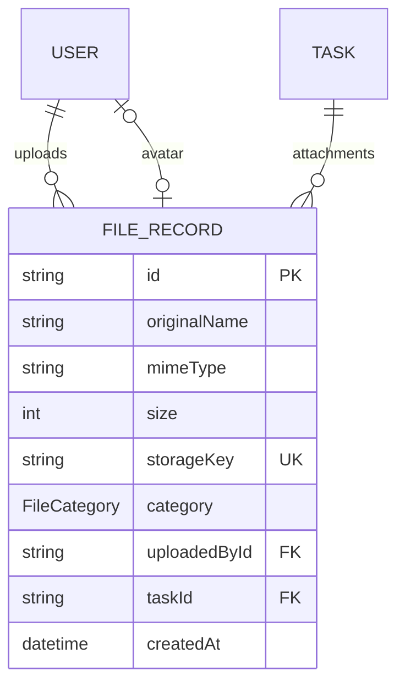

# Lesson 25 — Secure File & Image Upload

Implementation report for the Nexus learning roadmap.

## A. Feature Overview

Lesson 25 adds a production-style **file & image upload architecture** to Nexus:

- A **server-side file validation** utility (`validateFile`) enforcing file existence, size limits, and MIME allow-lists.
- **Centralized upload policies** (`uploadPolicies`) with distinct rules for `avatar` and `attachment`, so limits live in one place.
- A **storage abstraction** (`FileStorage`) with a development-safe **local filesystem driver**, safe storage-key generation, and filename sanitization.
- A **`FileRecord` Prisma model** that stores only metadata/reference information. File *bytes* are kept out of PostgreSQL.
- **User avatar upload** wired into the existing (previously a stub) profile page, with the avatar shown in the top-right user dropdown.
- **Task attachments** on the project board, with a management dialog (list + upload).
- A **file-serving route handler** (`GET /api/files/[...key]`) that authenticates, authorizes (attachments require project membership), and streams bytes with the recorded MIME type.

The goal — per the lesson — is not a fake upload UI or a standalone demo, but a realistic, extensible foundation that Lesson 26 and Lesson 28 can build on (object storage, presigned uploads, scanning, CDN, etc.).

## B. Existing Architecture Discovered

| Area | What exists |
| --- | --- |
| **Authentication** | Database sessions. `src/lib/auth.ts` `getCurrentUser()` reads the HTTP-only `session_token` cookie, loads `Session` + `User`, checks expiry. `src/proxy.ts` is a cookie-presence redirect only — the authoritative check always happens in servers. |
| **Authorization** | `src/lib/authorization.ts`: `requireWorkspacePermission(workspaceId, permission)` and `requireProjectPermission(projectId, permission)` with role→permission tables for `Role` and `ProjectRole`. Project membership (`ProjectMember`) is independent of workspace membership. |
| **Mutation architecture** | Two styles: **Server Actions** returned as `{ success, error }` state consumed via `useActionState` for form flows (register/login, create/update/delete project & task); **Route Handlers** returning `NextResponse.json`/`apiError()` for REST-style access (invitations, notifications, projects API). Form mutations use Server Actions, so uploads follow that style. |
| **Validation** | Zod schemas in `src/schemas/*` (`project.schema.ts`, `task.schema.ts`, `auth.schema.ts`…). Actions parse `formData.entries()` with `.safeParse` and return the first issue as the user-facing error. |
| **Prisma** | Prisma 7 with the `postgresql` provider, driver adapter `@prisma/adapter-pg`, generated client output to `src/generated/prisma` (gitignored). Models: `User`, `Session`, `Workspace`, `Membership`, `Project`, `ProjectMember`, `Task`, `Invitation`, `Notification`, `OAuthAccount`, `EmailVerificationToken`. Migration dir `prisma/migrations`. |
| **UI structure** | `(protected)` App Router group with `TopHeader`/`ClientTopHeader`/`UserProfileDropdown`, `dashboard/profile` page (was a stub), project board (`ProjectBoard`, `BoardCard`, column components), daisyUI + Tailwind, `react-toastify`, modals implemented as native `<dialog>` elements. |
| **Revalidation** | `revalidatePath(path)` after mutations; the project board is remounted via a `key` derived from server data. |

No upload/file-persistence code existed before this lesson (`src/lib/files/validate-file.ts` was an empty stub, and `src/lib/data/attachments.ts` holds an in-memory sample used by placeholder dashboard cards — not real backend persistence).

## C. Files Changed

| File | Change | Why |
| --- | --- | --- |
| `prisma/schema.prisma` | Added `FileCategory` enum, `FileRecord` model, `User.avatarFile`/`uploadedFiles` relations, `Task.attachments`. | Persist upload metadata/references relationally instead of raw bytes. |
| `prisma/migrations/20260912095538_add_file_uploads/migration.sql` | New migration creating enum, table, indexes, FKs. | Schema drift must be tracked in migrations. |
| `src/generated/prisma/**` | Regenerated Prisma Client. | Schema change requires regenerated client (gitignored, not committed). |
| `src/lib/files/validate-file.ts` | Rewrote the empty stub into the typed server-side validator. | Single validation gate (existence, size, MIME) with a discriminated-union result. |
| `src/lib/files/upload-policies.ts` | New centralized policies (`avatar`, `attachment`). | Sized/type limits centralized and reusable; SVG excluded for XSS safety. |
| `src/lib/files/storage.ts` | New storage abstraction + local filesystem driver, `getStorage()`, safe key builder, filename sanitizer, MIME→extension map. | Bytes never go into Postgres; safe keys replace client filenames; provider can be swapped later. |
| `src/lib/data/file-records.ts` | New `deleteStoredFileRecord()` best-effort helper (bytes + metadata). | Avatar replacement cleans up the previous file; reusable for future deletion flows. |
| `src/actions/user.actions.ts` | New `updateAvatar` Server Action. | Avatar upload flow with auth → validate → store → persist → cleanup → revalidate. |
| `src/actions/task.actions.ts` | Added `uploadTaskAttachment` Server Action + imports. | Task attachment upload reusing the same validation/storage pipeline with project authorization. |
| `src/app/api/files/[...key]/route.ts` | New file-serving route handler (GET, streaming). | Serve avatars/attachments with auth + authorization without exposing filesystem details. |
| `src/lib/auth.ts` | `getCurrentUser()` now includes `avatarFile`. | Header/dropdown/profile can render the avatar from one source. |
| `src/lib/data/projects.ts` | `getProjectById()` now includes each task's `attachments`. | Board card/modal needs attachment metadata. |
| `src/app/(protected)/projects/[projectId]/_components/types.ts` | Payload type now includes `attachments: true`; added `ProjectAttachment`. | Keeps board typing aligned with the new query. |
| `src/app/(protected)/projects/[projectId]/page.tsx` | `boardKey` now includes total attachment count. | Board remounts with fresh data after an upload. |
| `src/app/(protected)/projects/[projectId]/_components/TaskAttachmentModal.tsx` | New dialog: lists attachments + upload form. | Task attachment UX. |
| `src/app/(protected)/projects/[projectId]/_components/board/BoardCard.tsx` | Added `TaskAttachmentModal` to the card toolbar. | Entry point to manage a task's attachments. |
| `src/app/(protected)/dashboard/profile/page.tsx` | Replaced stub with a real profile page (avatar + account info). | Avatar upload UI "where it fits naturally". |
| `src/app/(protected)/dashboard/profile/_components/AvatarUploadForm.tsx` | New avatar preview + upload form. | Avatar UX with success/error/pending states. |
| `src/app/(protected)/dashboard/_components/UserProfileDropdown.tsx` | Shows avatar image when present (initials fallback). | Avatar visible across protected pages. |
| `src/app/(protected)/dashboard/_components/ClientTopHeader.tsx` | `User` prop type extended with `avatarFile`. | Type alignment for the dropdown. |
| `.gitignore` | Ignored `/uploads/`. | Local storage bytes must not be committed. |
| `.env.example` | Documented `STORAGE_DRIVER` / `STORAGE_DIR`. | Config lives in environment, not code. |
| `docs/lesson-25-report.md` | This report. | Required deliverable. |

Notes:
- `src/lib/data/attachments.ts` was **not** changed — its in-memory sample is consumed only by the placeholder dashboard activity/stats cards, which are outside this lesson's scope.
- No new runtime dependencies were added. Everything uses existing packages (`zod`, Next.js built-ins, Node `fs`/`crypto`) plus the already-present `@prisma/adapter-pg` dependency tree.

## D. Upload Flow (as implemented)

**Avatar**

```text
User selects an image on /dashboard/profile
  ↓
<input type="file" name="avatar" accept="image/jpeg,image/png,image/webp">
  ↓
FormData submitted to the updateAvatar Server Action (useActionState form)
  ↓
getCurrentUser()            → authenticate (session cookie, expiry)
  ↓
validateFile(file, uploadPolicies.avatar)
  ↓ existence → size → MIME allow-list
  ↓
buildStorageKey("avatar", file.type)   → avatar/<uuid>.jpg
sanitizeFilename(file.name)            → display-only safe name
  ↓
getStorage().save(storageKey, bytes)   → local filesystem under uploads/
  ↓
Transaction: create FileRecord (AVATAR) + set User.avatarFileId
  ↓
deleteStoredFileRecord(previous avatar)  → remove old bytes + row
  ↓
revalidatePath("/dashboard/profile") + revalidatePath("/", "layout")
  → server refresh, dropdown + profile re-render with new avatar
  ⇧
UI: toast "Avatar updated!", preview refreshed
```

**Task attachment**

```text
User opens the paperclip dialog on a BoardCard
  ↓
FormData submitted to the uploadTaskAttachment Server Action
  ↓
getCurrentUser()                         → authenticate
validate taskId                         → required string
prisma.task.findUnique                  → resolve owning project
requireProjectPermission(projectId, "UPDATE_TASK") → authorize
validateFile(file, uploadPolicies.attachment)      → validate
  ↓
buildStorageKey("attachment", file.type) → attachment/<uuid>.<ext>
  ↓
getStorage().save(...)                  → store bytes
prisma.fileRecord.create(...)           → persist metadata (taskId, uploader)
  ↓
revalidatePath(`/projects/${projectId}`)
  → project page re-renders; boardKey includes attachment count → board remounts
  ⇧
UI: toast "Attachment uploaded!", dialog closes, attachment appears in list
```

**Serving**

```text
GET /api/files/avatar/<uuid>.jpg
  ↓ params route [...key] → storageKey
  ↓ getCurrentUser()                       → 401 if unauthenticated
  ↓ fileRecord.findUnique(storageKey)      → 404 if missing
  ↓ if ATTACHMENT → task → requireProjectPermission("VIEW_PROJECT")  → 403 if not a member
  ↓ getStorage().read(storageKey)          → bytes or 404
  ↓ 200 with recorded Content-Type, Content-Length, inline Content-Disposition
```

## E. Validation

Implemented in `src/lib/files/validate-file.ts` and `src/lib/files/upload-policies.ts`.

| Concern | Implementation |
| --- | --- |
| Missing file | Any non-`File` value (`null`, `undefined`, string) → `NO_FILE`. The server only accepts a real `File` produced from parsed multipart `FormData`. |
| Empty file | `size === 0` → `EMPTY_FILE`. |
| Size | `size > policy.maxSize` → `FILE_TOO_LARGE`. Avatar: 2 MB; attachment: 10 MB. |
| MIME type | `type` must be in the policy's allow-list → otherwise `INVALID_TYPE`. `image/svg+xml` is excluded everywhere (SVG can carry executable scripts). |
| Unsafe filenames / keys | The client's filename is **never** a storage path. `sanitizeFilename()` strips path separators/control chars/leading dots and caps length (the result is only stored as `originalName` for display and used in `Content-Disposition`). Storage keys come from `buildStorageKey()` = `category/<randomUUID>.<ext>` where the extension is derived from the **MIME type**, not the filename (so `photo.exe` can never influence the served filename). |

Validation results are a discriminated union: `{ ok: true; file } | { ok: false; error: FileValidationErrorKind }`, with a `fileValidationErrors` map containing user-facing messages. New policies (e.g. a future `ProjectAttachment` with different limits) are just new entries in `uploadPolicies`.

## F. Security Decisions

- **Why client validation is insufficient**: the browser can be bypassed; callers can POST arbitrary bytes/names without ever opening the page. Every action calls the server-side `validateFile`, and the UI's `accept` attribute is only a convenience hint.
- **Where authorization occurs**: inside the Server Actions and the route handler, using the existing `getCurrentUser()` + `requireProjectPermission()` helpers — never in the client. The proxy cookie-check remains a UX redirect, not a security boundary.
- **Path traversal prevention**: storage keys destined for the filesystem are server-generated; on top of that `LocalFileStorage.resolvePath()` normalizes the key and verifies the resolved path stays inside the uploads root (`uploads/`), rejecting escapes — a second line of defense even for keys coming from the URL. (Verified by test: `storage.read("../../outside.txt")` throws.)
- **Unsafe filenames**: never used as paths. `sanitizeFilename()` (see §E) plus a unique key means we can never overwrite an unrelated file (no collision, no `..`).
- **Storage access protection**: files are not served from `public/`; they're read through `GET /api/files/[...key]`, which authenticates every request and gates attachments behind project `VIEW_PROJECT`. Byte access requires an authenticated session.
- **Response hardening**: `X-Content-Type-Options: nosniff` and the Content-Type is the value recorded at upload time (never derived from the filename).
- **No secrets to the client**: storage keys are served in URLs, but filesystem paths and driver configuration remain server-only. Env vars (`STORAGE_DRIVER`, `STORAGE_DIR`) stay in `.env`/`.env.example`.
- **Remaining limitations (honest)**: we validate the **declared** MIME type only — no content sniffing and no malware scanning, because full scanning is out of scope and faking it would be worse (see §M and §N). Also note a pre-existing issue surfaced while touching `auth.ts`: `getCurrentUser()` returns the full `User` row (including `passwordHash`) into client serialization on the header path; that predates this lesson and was left untouched to keep the change focused.

## G. Database Design

Added one model. PostgreSQL stores **metadata/reference only** — never file bytes.

```prisma
enum FileCategory { AVATAR ATTACHMENT }

model FileRecord {
  id           String       @id @default(cuid())
  originalName String
  mimeType     String
  size         Int
  storageKey   String       @unique
  category     FileCategory @default(ATTACHMENT)
  uploadedById String
  taskId       String?
  createdAt    DateTime     @default(now())

  uploadedBy   User         @relation("UploadedFiles", fields: [uploadedById], references: [id])
  avatarFor    User?        @relation("AvatarFile")
  task         Task?        @relation(fields: [taskId], references: [id], onDelete: SetNull)

  @@index([uploadedById]) @@index([taskId]) @@index([category])
}
```

Relations added to existing models:

```text
User  (1)──(1) FileRecord   avatarFile       (unique on User.avatarFileId, ON DELETE SET NULL)
User  (1)──(N) FileRecord   uploadedFiles    (uploadedById)
Task  (1)──(N) FileRecord   attachments      (taskId, ON DELETE SET NULL)
```



What's inside PostgreSQL: description of the file (name, MIME, size), who uploaded it, which task it belongs to, and the opaque `storageKey` pointing at the real bytes. What's outside: the bytes themselves (filesystem now, object storage later). Why: small, fast relational rows; accepting multi-MB blobs in Postgres hurts every listing query and complicates CDN/scanning later.

One model (`FileRecord`) intentionally serves both avatars and attachments (a `category` enum) instead of separate `Avatar`/`Attachment` tables — avoids duplicate concepts ("do not over-model").

## H. Storage Design

- **Where**: local filesystem under `<project>/uploads/` (`STORAGE_DIR`, default from `process.cwd()`), chosen by `STORAGE_DRIVER="local"` (the default). It is gitignored.
- **Keys**: `category/<randomUUID>.<ext>` (e.g. `avatar/9a…f.jpg`, `attachment/5b….pdf`), namespace-scoped, collision-free, no user-controlled characters; extension derived from MIME.
- **Why**: no external provider/credentials are configured in this repo, so inventing cloud credentials would be wrong. A documented interface (`FileStorage: save/read/delete`) plus `getStorage()` returns the local driver; every upload path goes through the interface.
- **Production change**: implement `FileStorage` with the S3/R2/GCS SDK (or swap to presigned uploads), set `STORAGE_DRIVER`, keep keys identical — actions, validation, and the route handler stay untouched. The route handler's boolean "did read return bytes" logic is compatible with an object store (a 404-style absence maps to `read → null`).

## I. UX

- **Pending state**: the shared `SubmitButton` uses `useFormStatus().pending` → "Uploading…", disabled while pending.
- **Errors**: server `{ error }` from the action is rendered next to the file input via `aria-describedby`, inline in `text-error`, and toast notifications (`react-toastify`, already used across the app). No leaking of stack traces — actions map failures to user messages and `console.error` the details server-side.
- **Success**: toasts "Avatar updated!" / "Attachment uploaded!". The profile preview and the board refresh through revalidation/remount.
- **Accessibility**: labelled file inputs (visible `<label htmlFor>`), `aria-describedby` error wiring, native `<dialog>` modals with close button, close-on-Escape, and backdrop close following the existing modal pattern; the paperclip button has an `aria-label`. The avatar preview has `alt` text.
- **Scope kept minimal**: no redesign of unrelated screens; the profile page was a stub and became the natural avatar home.

## J. Revalidation / Cache

- `updateAvatar`: `revalidatePath("/dashboard/profile")` then `revalidatePath("/", "layout")` because the top header (avatar dropdown) renders on every protected page.
- `uploadTaskAttachment`: `revalidatePath(\`/projects/${task.projectId}\`)` — narrow to the one affected project, not global.
- The project board's client state is keyed by `boardKey` which now folds in the total attachment count (alongside task count/list), so after a successful upload the board and attachment modal remount with fresh server data.
- Server Actions invoked from client forms automatically trigger a router refresh, applying the revalidated data.

## K. Commands Run

All commands below were actually executed in this environment:

```text
pnpm exec prisma migrate status
pnpm exec prisma migrate dev --name add_file_uploads        # failed twice: (1) schema validation — missing opposite relation field, fixed; (2) non-interactive environment refused the warning prompt
pnpm exec prisma migrate diff --from-schema-datasource …    # failed: flag removed in Prisma 7
pnpm exec prisma migrate diff --from-config-datasource --to-schema prisma/schema.prisma --script
pnpm exec prisma migrate deploy
pnpm exec prisma generate
pnpm lint                                                  # ran repeatedly; final run clean
pnpm exec tsc --noEmit
pnpm build
pnpm exec tsc src/lib/files/{validate-file,upload-policies}.ts … --outDir <temp> --module commonjs …   # compile real modules for a smoke test
node <temp>/verify.cjs                                     # 16 focused assertions (see L)
pnpm dev (restart) + curl.exe checks against GET /api/files/[...key]   # live e2e matrix
node <temp>/seed.cjs / cleanup.cjs / check-cleanup.cjs      # seeded, verified, and removed a test user/workspace/project/task/file set
```

Why `migrate dev` was not used for the final migration: it refused to run non-interactively because of the `avatarFileId`-uniqueness warning, so the SQL was generated with `prisma migrate diff` (ground truth = live DB `--from-config-datasource` vs `--to-schema`), committed as `prisma/migrations/20260912095538_add_file_uploads/`, then applied with `prisma migrate deploy`. `migrate status` confirms the DB is up to date.

## L. Verification Results

| Check | Result | Evidence |
| --- | --- | --- |
| `pnpm lint` | **PASS** | clean final run (0 problems) |
| `pnpm exec tsc --noEmit` | **PASS** | no output |
| `pnpm build` | **PASS** | compiled in ~7s, TypeScript finished, 21 routes generated, `/api/files/[...key]` present |
| Prisma client generation | **PASS** | "Generated Prisma Client (7.9.1)" |
| `prisma migrate status` | **PASS** | "Database schema is up to date!" (12 migrations) |
| Focused module tests (`verify.cjs`, compiled real code) | **PASS** | **16/16**: valid upload, missing file, empty file, oversized, bad MIME, SVG rejected, pdf policy split, error messages, path sanitization (`../`, `folder\`, control chars, dots, empty), MIME→ext, unique keys, storage round-trip, traversal rejection |
| Live route matrix (dev server + curl) | **PASS** | avatar + member: 200 (image/jpeg, exact bytes); avatar + other user: 200; member attachment: 200 (application/pdf); non-member attachment: 403; no cookie: 401 |
| Test-data cleanup | **PASS** | 0 leftover `FileRecord`/`Session`/`User` rows; `uploads/` test files removed |
| Repository test suite | **NOT RUN** | the repo has no test runner/script (only `dev`, `build`, `start`, `lint`); the focused checks above were run as a one-off compiled-module script instead. |
| Browser click-through of the new UI | **NOT RUN** | no browser automation available; verified via server actions' live HTTP contract and module tests instead. |

## M. Known Limitations

- **Local filesystem storage only** — no S3/R2/GCS; the abstraction is in place but only the `local` driver is implemented.
- **No content sniffing** — the MIME type is trusted from the upload (an attacker can send arbitrary bytes with `type: image/png`). Size/type limits still bound the blast radius; serving uses the recorded type + `nosniff`.
- **No malware/virus scanning** — out of scope; faking it was deliberately avoided. `src/lib/files/storage.ts` and the actions are structured so a scan hook can be inserted before persistence.
- **No presigned/direct-to-storage uploads** — bytes pass through the Next.js server (correct for this stage; note a large-file/`serverActions.bodySizeLimit` ceiling exists, avatar/attachment policies are far below it).
- **No CDN and no signed download URLs** — files stream through `/api/files`, cached privately for 1h per request.
- **No attachment deletion UI** — upload + list + open is implemented; deleting/replacing attachments beyond the avatar-replacement path is left for a later lesson.
- **Pre-existing, untouched**: `getCurrentUser()` serializes the full `User` row (incl. `passwordHash`) into the header client payload; `src/lib/data/attachments.ts` still feeds placeholder dashboard mock data. Both are out of Lesson 25 scope.
- **Development restart required after `prisma generate`** — the previously running dev server held a stale generated client (it 500'd on the new routes), so it was restarted (see note in report footer).

## N. Future Extension

- **Production object storage**: implement `FileStorage` with an S3 SDK (or R2/GCS); keep `category/<uuid>.<ext>` keys. Zero changes in actions/validation/routes.
- **Image optimization**: route `GET /api/files` bytes through `sharp`/`next/image` sizing for avatar variants, or move avatars to an image CDN.
- **Presigned uploads**: for large attachments, add a signed-upload endpoint that returns a temporary direct-storage URL; DB row created on completion callback.
- **Private attachments**: already the model here (project-gated reads); extend to per-record permission ACLs or signed download URLs with short TTLs.
- **Virus/malware scanning**: add a scan step in the storage pipeline (e.g. lambda/webhook) that flags `FileRecord` (a `scanStatus` enum) and only serves files marked clean.
- **Signed download URLs**: replace the streaming route with expiring HMAC-signed URLs; the current route stays as the compatibility fallback.
- **Attachment lifecycle**: delete UI + quotas per project/workspace, reusing `deleteStoredFileRecord`.

## O. Engineering Decisions

| Decision | What we chose | Why | Alternatives | Why not |
| --- | --- | --- | --- | --- |
| Mutation style | Server Actions (`{success,error}` + `useActionState`), one new action file `user.actions.ts` and one addition in `task.actions.ts` | The repo already uses Server Actions for every form-driven mutation; uploads are form-driven. No second mutation style "for variety". | Route handler with `fetch` + JSON/Blob from the client | Would introduce a parallel mutation style and duplicate the auth/validation plumbing already proven in actions. |
| Binary storage | Local filesystem through a `FileStorage` interface; DB keeps metadata only | No cloud provider is configured; writing bytes into Postgres was explicitly disallowed by the task; interface keeps the swap path clean. | Store blobs as `bytea` in Postgres; or npm-install an S3 SDK now | `bytea` couples storage to the DB and hurts listing queries; an unused S3 SDK is the "dependency because it might be useful later" the task forbids. |
| DB model shape | One generic `FileRecord` + `category` enum | "Do not over-model": avatars and attachments share the same metadata shape; one relation each to `User`/`Task`. | Separate `Avatar` and `Attachment` models | Duplicate concept, duplicate code, no real benefit. |
| File key generation | `category/<uuid>.<ext>`, extension from MIME | Server-generated, collision-free, traversal-proof, no client string in the path. | Derive from the sanitized filename; or user-supplied `id` | Any client-derived path component is an overwrite/traversal risk. |
| Filename handling | Original name sanitized and kept display-only | Needed for the download name; never trusted as a path. | Throw away the original name | Less friendly UI for zero security gain. |
| MIME validation | Strict allow-list of declared types (no sniffing) | Matches "do not fake it": real content inspection is a separate later capability; allow-lists match policies precisely. | Magic-bytes sniffing | Without a scanner, sniffing adds complexity + false positives; noted as a limitation. |
| Serving files | Authorized streaming route (`GET /api/files/[...key]`) | Works today, gives real authorization for attachments, no `public/` exposure, provider-agnostic. | Copy uploads to `public/` and link directly | Unauthenticated public access to private attachments — violates the lesson. |
| Serving avatars | Any authenticated user can read an avatar | Avatars are non-sensitive and greasily rendered across the app header. | Avatar reads gated to owner | Would complicate the header fetch for no security benefit. |
| Revalidation | `revalidatePath` on the specific profile/layout + the one project page | Precise invalidation per Lesson 24 guidance; no global cache nukes. | `revalidatePath("*")` / `router.refresh()` everywhere | Coarse, invalidates unrelated UI. |
| New dependencies | **None** | Existing packages cover everything (zod, Next, Node fs/crypto, existing toast/daisyUI). | `multer`, `sharp`, `s3-sdk`, `@uploadthing/react`, ... | Genuinely unnecessary at this stage; blocked by the dependency constraint. |

---

Report scope note (operations): the running `next dev` server on port 3000 was **restarted** during verification because it had been started before `prisma generate` and served a stale Prisma client that errored on the new models/routes. A fresh `next dev` is running. The migrated schema is otherwise unchanged, and all temporary test rows/files created for verification were removed afterwards.